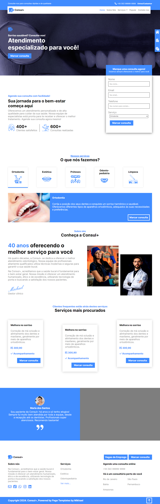

<h1>
    <a href="https://paulo-mikhael.github.io/consul-plus">Consul+ Odontologia e Estética</a>
</h1>
<h2>Sobre ✏️</h2>
    <h3>A Consul+ é uma rede de consultórios fictícios de odontologia, esta landing page conta com um formulário para contato, descrição dos serviços, seção 'sobre nós', e os serviços mais populares, tudo isso sendo apresentado com uma interface intuitiva, profissional e limpa de informações desnecessárias.</h3>
<h2>Estado do projeto 🚧</h2>
    <h3>
        Completo ✔️ Responsivo ✔️
    </h3>
<h2>Tecnologias 💻</h2>
    

        
        
    

<h2>Design da página</h2>
    
<h2>Talvez você queira ver 💡</h2>
    <a target="_blank" href="https://paulo-mikhael.github.io/Portifolio">Portifolio</a> 
    <a target="_blank" href="https://drive.google.com/drive/folders/1ER7n3GHZmokEsQJkf6yFAG3E0dC1oLfq?usp=drive_link">Currículo (png, jpg ou pdf)</a> 
    <a target="_blank" href="https://drive.google.com/drive/folders/1xjtcNhKtKOvbJU_L9Qb6QOUW7OzcUmW6?usp=drive_link">Design da página (png, jpg ou pdf)</a>
<h2>Confira meus outros projetos 🛠️</h2>
    <a target="_blank" href="https://paulo-mikhael.github.io/fastask">Fastask - Gerenciador de tarefas</a> 
    <a target="_blank" href="https://paulo-mikhael.github.io/academia-landing-page">Landing Page para uma Academia</a> 
    <a target="_blank" href="https://paulo-mikhael.github.io/pagina-unity-2024">[Clone] Pagina da Unity</a> 
    <a target="_blank" href="https://paulo-mikhael.github.io/pagina-gartic-2024">[Clone] Pagina do Gartic</a>